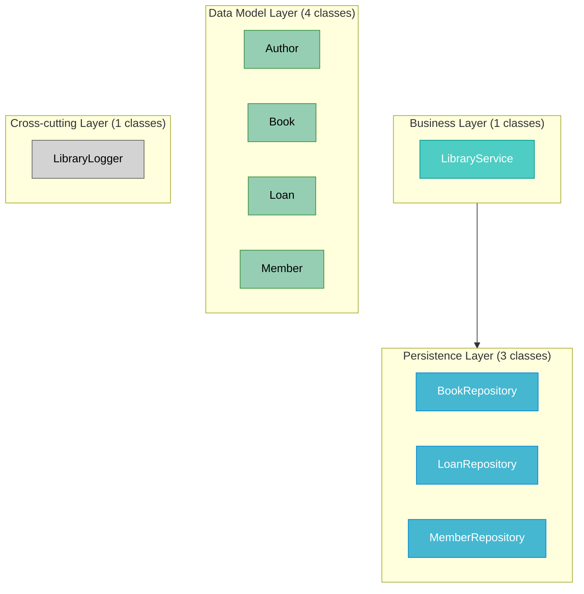
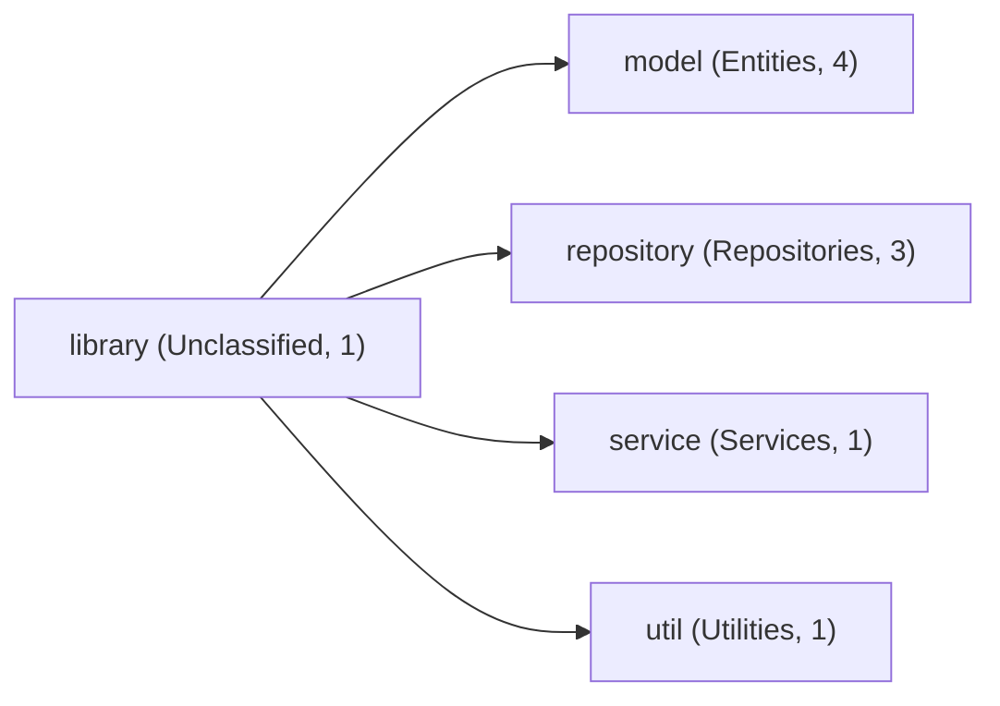
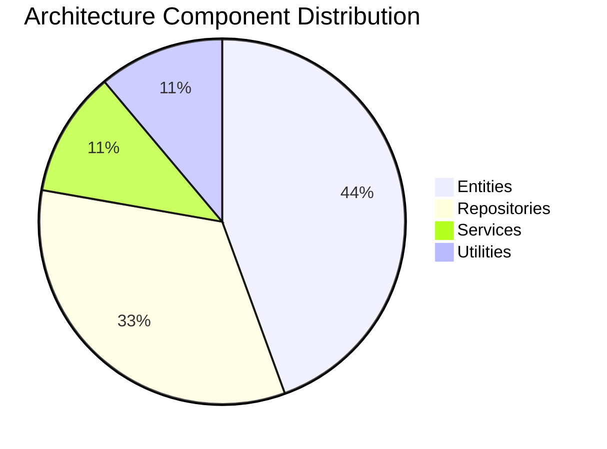
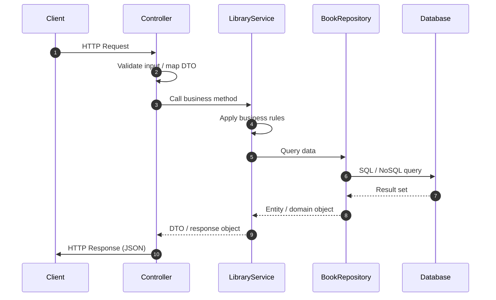
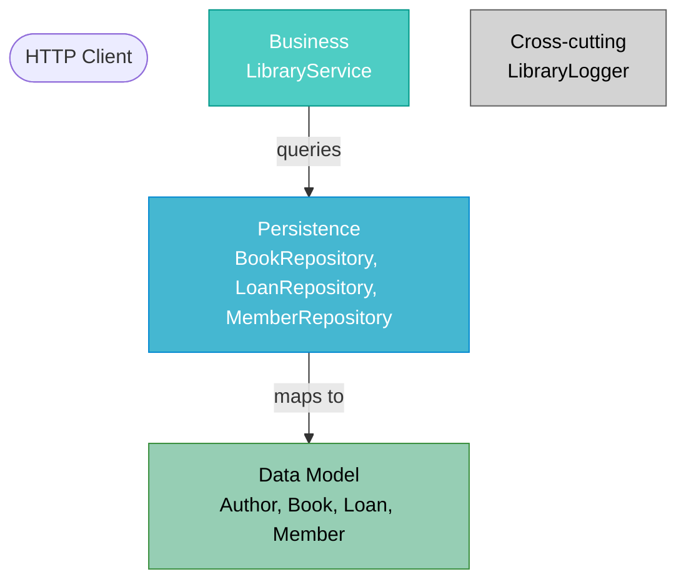

# Architecture Diagrams

## Layer Diagram

```mermaid
graph TB
    %% Architectural Layer Diagram
    subgraph Business["Business Layer (1 classes)"]
        LibraryService[LibraryService]
    end
    subgraph Persistence["Persistence Layer (3 classes)"]
        BookRepository[BookRepository]
        LoanRepository[LoanRepository]
        MemberRepository[MemberRepository]
    end
    subgraph Data_Model["Data Model Layer (4 classes)"]
        Author[Author]
        Book[Book]
        Loan[Loan]
        Member[Member]
    end
    subgraph Cross_cutting["Cross-cutting Layer (1 classes)"]
        LibraryLogger[LibraryLogger]
    end
    Business --> Persistence
    style LibraryService fill:#4ECDC4,stroke:#009688,color:#fff
    style BookRepository fill:#45B7D1,stroke:#0288d1,color:#fff
    style LoanRepository fill:#45B7D1,stroke:#0288d1,color:#fff
    style MemberRepository fill:#45B7D1,stroke:#0288d1,color:#fff
    style Author fill:#96CEB4,stroke:#388e3c,color:#000
    style Book fill:#96CEB4,stroke:#388e3c,color:#000
    style Loan fill:#96CEB4,stroke:#388e3c,color:#000
    style Member fill:#96CEB4,stroke:#388e3c,color:#000
    style LibraryLogger fill:#D3D3D3,stroke:#616161,color:#000
```

## Package Diagram

```mermaid
graph LR
    %% Package Structure Diagram
    com_library["com.library"]
    com_library["library (Unclassified, 1)"]
    com_library_model["model (Entities, 4)"]
    com_library --> com_library_model
    com_library_repository["repository (Repositories, 3)"]
    com_library --> com_library_repository
    com_library_service["service (Services, 1)"]
    com_library --> com_library_service
    com_library_util["util (Utilities, 1)"]
    com_library --> com_library_util
```

## Component Pie

```mermaid
pie title Architecture Component Distribution
    "Entities" : 4
    "Repositories" : 3
    "Services" : 1
    "Utilities" : 1
```

## Request Flow

```mermaid
sequenceDiagram
    autonumber
    participant Client
    participant Controller
    participant LibraryService
    participant BookRepository
    participant Database

    Client->>Controller: HTTP Request
    Controller->>Controller: Validate input / map DTO
    Controller->>LibraryService: Call business method
    LibraryService->>LibraryService: Apply business rules
    LibraryService->>BookRepository: Query data
    BookRepository->>Database: SQL / NoSQL query
    Database-->>BookRepository: Result set
    BookRepository-->>LibraryService: Entity / domain object
    LibraryService-->>Controller: DTO / response object
    Controller->>Client: HTTP Response (JSON)
```

## Dependency Flow

```mermaid
flowchart TD
    %% Dependency Flow Diagram

    Client([HTTP Client])

    Business["Business\nLibraryService"]
    Persistence["Persistence\nBookRepository, LoanRepository, MemberRepository"]
    Data_Model["Data Model\nAuthor, Book, Loan, Member"]
    Cross_cutting["Cross-cutting\nLibraryLogger"]

    Business -->|"queries"| Persistence
    Persistence -->|"maps to"| Data_Model
    style Business fill:#4ECDC4,stroke:#009688,color:#fff
    style Persistence fill:#45B7D1,stroke:#0288d1,color:#fff
    style Data_Model fill:#96CEB4,stroke:#388e3c,color:#000
    style Cross_cutting fill:#D3D3D3,stroke:#616161,color:#000
```
