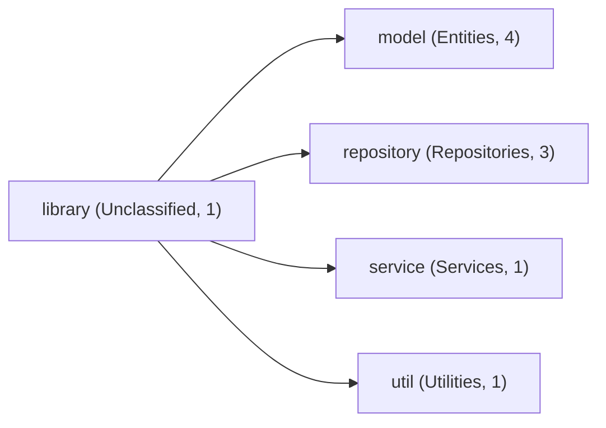
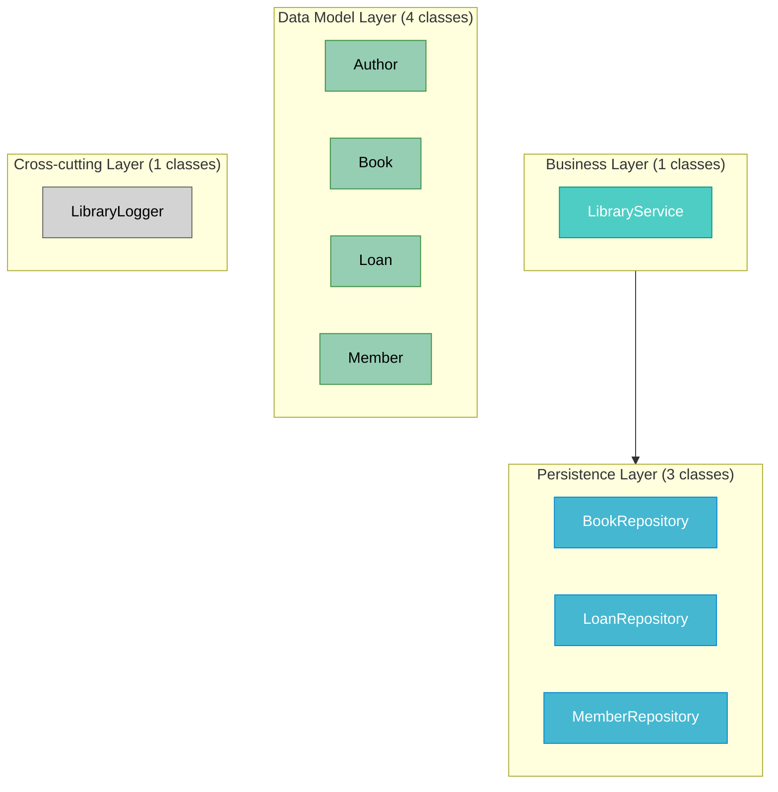
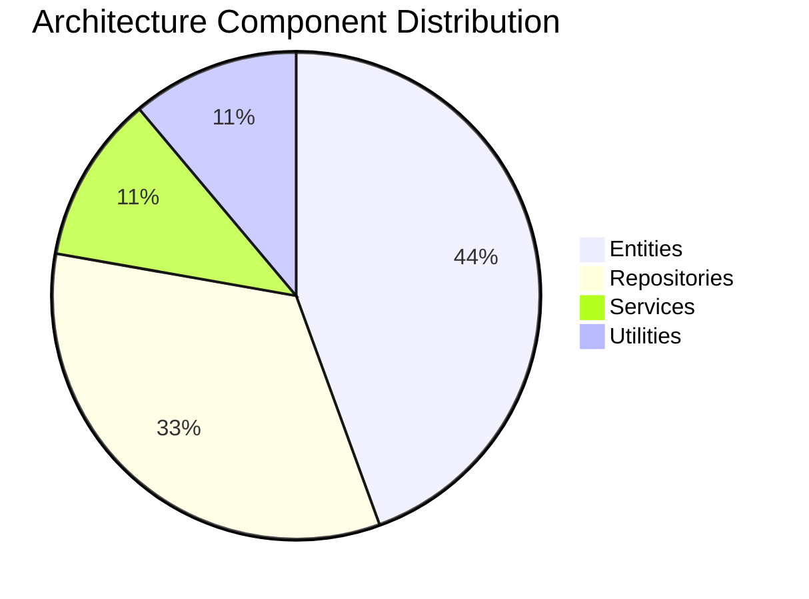
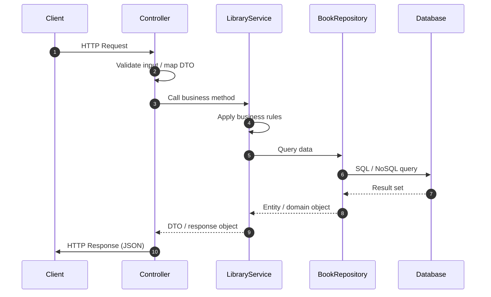
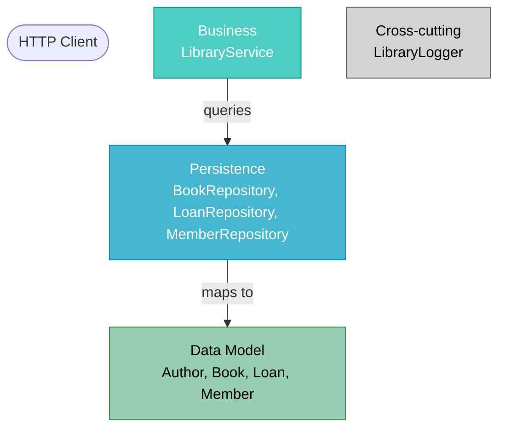

# Library -- Architecture Onboarding Guide

> Auto-generated by RetroDecrypt Engine  on 2026-06-23 15:42

---

## Table of Contents
1. [Project Overview](#1-project-overview)
2. [Architecture Summary](#2-architecture-summary)
3. [Package Structure](#3-package-structure)
4. [Layered Architecture](#4-layered-architecture)
5. [Key Components](#5-key-components)
6. [Spring Boot Patterns](#6-spring-boot-patterns)
7. [Module Boundaries](#7-module-boundaries)
8. [Request Flow](#8-request-flow)
9. [C4 Architecture Model](#9-c4-architecture-model)
10. [Quick Start Guide](#10-quick-start-guide)
11. [Architecture Diagrams](#11-architecture-diagrams)
12. [Architecture Review](#12-architecture-review)

## 1. Project Overview

This is a Spring Boot application (entry point: the main Application class) with 10 Java classes. Start by reading the controllers to understand the API surface, then trace through LibraryService for business logic. The codebase follows a standard layered architecture with Business, Persistence, Data Model layers.

| Metric | Value |
|--------|-------|
| Base Package | `com.library` |
| Total Classes | 10 |
| Architectural Layers | 5 |
| Feature Modules | 4 |
| Detection Rate | 90% |

## 2. Architecture Summary

The application uses a 5-layer architecture: Business, Persistence, Data Model, Cross-cutting, Unknown. The presentation layer contains 0 controller(s), the business layer has 1 service(s), and the persistence layer exposes 3 repository/repositories.

## 3. Package Structure

### Package Hierarchy



| Package | Role | Classes |
|---------|------|---------|
| `com.library` | Unclassified | 1 |
| `com.library.model` | Entities | 4 |
| `com.library.repository` | Repositories | 3 |
| `com.library.service` | Services | 1 |
| `com.library.util` | Utilities | 1 |

## 4. Layered Architecture

### Layer Overview



**Business Layer** (1 classes)

Classes: `LibraryService`

**Persistence Layer** (3 classes)

Classes: `BookRepository`, `LoanRepository`, `MemberRepository`

**Data Model Layer** (4 classes)

Classes: `Author`, `Book`, `Loan`, `Member`

**Cross-cutting Layer** (1 classes)

Classes: `LibraryLogger`

**Unknown Layer** (1 classes)

Classes: `LibraryApp`

## 5. Key Components

### Component Distribution



| Role | Classes | Count |
|------|---------|-------|
| Entities | `Author`, `Book`, `Loan`, `Member` | 4 |
| Repositories | `BookRepository`, `LoanRepository`, `MemberRepository` | 3 |
| Services | `LibraryService` | 1 |
| Utilities | `LibraryLogger` | 1 |

## 6. Spring Boot Patterns

Spring Boot patterns detected: JPA/ORM: 4 entity class(es).

| Pattern | Detected | Count |
|---------|----------|-------|
| Spring Boot Main | No | - |
| REST Controllers | Yes | 0 |
| JPA Entities | Yes | 4 |
| Spring Data Repos | No | 0 |
| Spring Security | No | - |
| Scheduled Tasks | No | - |
| Async Processing | No | - |

## 7. Module Boundaries

4 module(s) detected. Modules: model, repository, service, util.

| Module | Root Package | Classes | Roles | Full-Stack |
|--------|-------------|---------|-------|------------|
| model | `com.library.model` | 4 | entity | No |
| repository | `com.library.repository` | 3 | repository | No |
| service | `com.library.service` | 1 | service | No |
| util | `com.library.util` | 1 | utility | No |

## 8. Request Flow

### Typical HTTP Request Flow



### Data Flow Through Layers



## 9. C4 Architecture Model

```text
============================================================
  C4 Model -- Level 1: System Context
============================================================

System: Library Service
Base Package: com.library

Description:
  The Library Service is a Spring Boot application that
  exposes 0 REST endpoint group(s) and manages
  10 Java classes across
  5 architectural layers.

External Actors:
  [Person] End User / Client Application
    -- Sends HTTP requests to REST controllers

External Systems:
  [System] Relational Database (JPA/Hibernate)

Relationships:
  Client      --[HTTPS/JSON]-->  Library Service
  Library Service  --[data]-->  Relational Database (JPA/Hibernate)

============================================================
  C4 Model -- Level 2: Container
============================================================

Containers:

  [Container: Spring Boot Application]  Library-service
    Technology : Java {}, Spring Boot
    Description: Main application container. Hosts
                 0 controller(s),
                 1 service(s),
                 3 repository/repositories.

  [Container: Database]  relational-db
    Technology : PostgreSQL / MySQL / H2 (via JPA/Hibernate)
    Description: Persistent storage for
                 4 entity type(s).

Container Relationships:
  Client        --[HTTPS/REST/JSON]-->  Library-service
  Library-service  --[JDBC/JPA]-->   relational-db

============================================================
  C4 Model -- Level 3: Component (Business Layer)
============================================================

Layer: Business
Classes: 1
Packages: com.library.service

Components:
  [Component]  LibraryService
               Package: com.library.service
               Methods: 11  Detection: naming (medium)


============================================================
  C4 Model -- Level 3: Component (Persistence Layer)
============================================================

Layer: Persistence
Classes: 3
Packages: com.library.repository

Components:
  [Component]  BookRepository
               Package: com.library.repository
               Methods: 8  Detection: naming (medium)

  [Component]  LoanRepository
               Package: com.library.repository
               Methods: 7  Detection: naming (medium)

  [Component]  MemberRepository
               Package: com.library.repository
               Methods: 6  Detection: naming (medium)


```

## 10. Quick Start Guide

Key entry points: service: LibraryService. Trace a request from Controller -> Service -> Repository to understand the data flow.

**Reading order for new developers:**

1. Trace `LibraryService` for business logic
2. Review `BookRepository` for data access patterns

## 11. Architecture Diagrams

> All diagrams are rendered by any Markdown viewer that supports Mermaid.

### Full Layer Architecture


### Package Hierarchy


### Component Distribution


## 12. Architecture Review

Architecture issues found: 1 unclassified class(es) -- consider adding Spring stereotypes or renaming: LibraryApp

---
_Generated by RetroDecrypt Engine -- 2026-06-23_