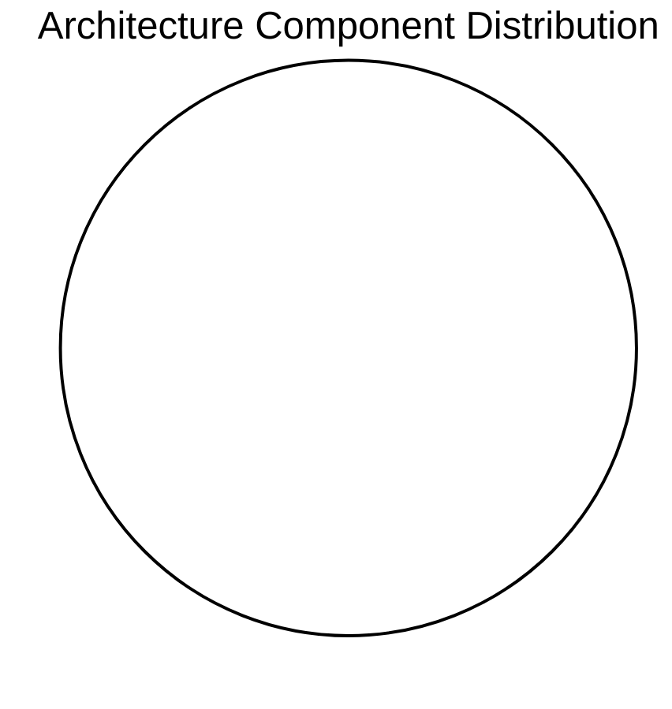
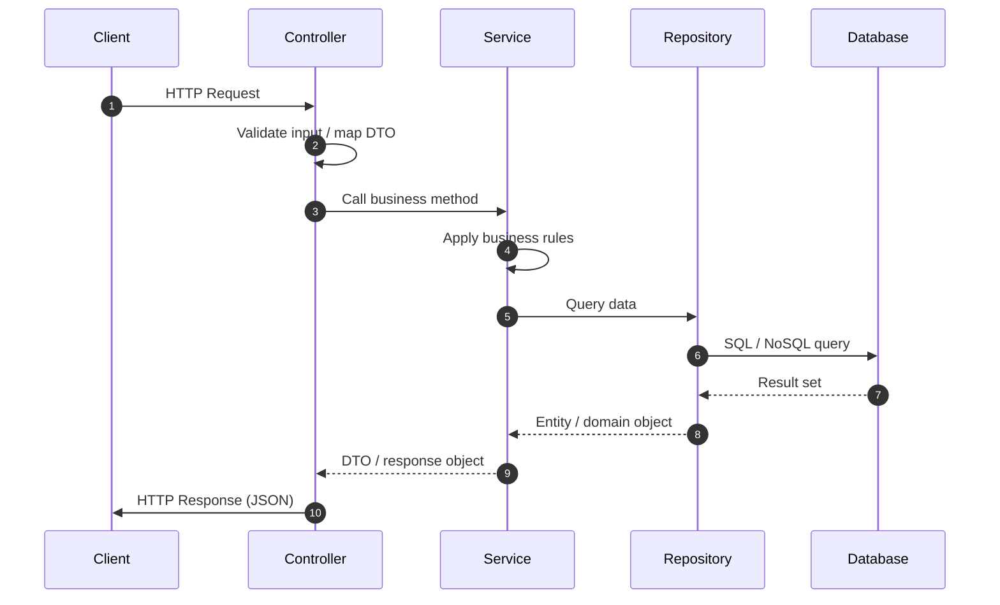
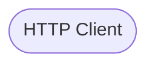

# Application -- Architecture Onboarding Guide

> Auto-generated by RetroDecrypt Engine  on 2026-06-15 17:31

---

## Table of Contents
1. [Project Overview](#1-project-overview)
2. [Architecture Summary](#2-architecture-summary)
3. [Package Structure](#3-package-structure)
4. [Layered Architecture](#4-layered-architecture)
5. [Key Components](#5-key-components)
6. [Spring Boot Patterns](#6-spring-boot-patterns)
7. [Module Boundaries](#7-module-boundaries)
8. [Request Flow](#8-request-flow)
9. [C4 Architecture Model](#9-c4-architecture-model)
10. [Quick Start Guide](#10-quick-start-guide)
11. [Architecture Diagrams](#11-architecture-diagrams)

## 1. Project Overview

This is a Spring Boot application with 0 Java classes organized across 0 layers.

| Metric | Value |
|--------|-------|
| Base Package | `unknown` |
| Total Classes | 0 |
| Architectural Layers | 0 |
| Feature Modules | 0 |
| Detection Rate | 0% |

## 2. Architecture Summary

------------------------------------------------------------
  Architecture Understanding Report
------------------------------------------------------------
  Base package         : unknown
  Total classes        : 0
  Detected roles       : 0
  Unclassified         : 0
  Modules detected     : 0

  Layer Breakdown:

  Role Distribution:
------------------------------------------------------------

## 3. Package Structure

### Package Hierarchy

```mermaid
graph LR
    %% Package Structure Diagram
```

| Package | Role | Classes |
|---------|------|---------|

## 4. Layered Architecture

### Layer Overview

```mermaid
graph TB
    %% Architectural Layer Diagram
```

## 5. Key Components

### Component Distribution



| Role | Classes | Count |
|------|---------|-------|

## 6. Spring Boot Patterns

No specific patterns detected.

| Pattern | Detected | Count |
|---------|----------|-------|
| Spring Boot Main | No | - |
| REST Controllers | Yes | 0 |
| JPA Entities | No | 0 |
| Spring Data Repos | No | 0 |
| Spring Security | No | - |
| Scheduled Tasks | No | - |
| Async Processing | No | - |

## 7. Module Boundaries

_No feature modules detected. Package structure is role-based._

## 8. Request Flow

### Typical HTTP Request Flow



### Data Flow Through Layers



## 9. C4 Architecture Model

```text
============================================================
  C4 Model -- Level 1: System Context
============================================================

System: Application Service
Base Package: unknown

Description:
  The Application Service is a Spring Boot application that
  exposes 0 REST endpoint group(s) and manages
  0 Java classes across
  0 architectural layers.

External Actors:
  [Person] End User / Client Application
    -- Sends HTTP requests to REST controllers

External Systems:
  [System] Persistent Data Store (unspecified)

Relationships:
  Client      --[HTTPS/JSON]-->  Application Service

============================================================
  C4 Model -- Level 2: Container
============================================================

Containers:

  [Container: Spring Boot Application]  Application-service
    Technology : Java {}, Spring Boot
    Description: Main application container. Hosts
                 0 controller(s),
                 0 service(s),
                 0 repository/repositories.

Container Relationships:
  Client        --[HTTPS/REST/JSON]-->  Application-service
  Application-service  --[JDBC/JPA]-->   relational-db

```

## 10. Quick Start Guide

See the controller classes for API entry points, then trace through services and repositories.

## 11. Architecture Diagrams

> All diagrams are rendered by any Markdown viewer that supports Mermaid.

### Full Layer Architecture

```mermaid
graph TB
    %% Architectural Layer Diagram
```

### Package Hierarchy

```mermaid
graph LR
    %% Package Structure Diagram
```

### Component Distribution


---
_Generated by RetroDecrypt Engine -- 2026-06-15_